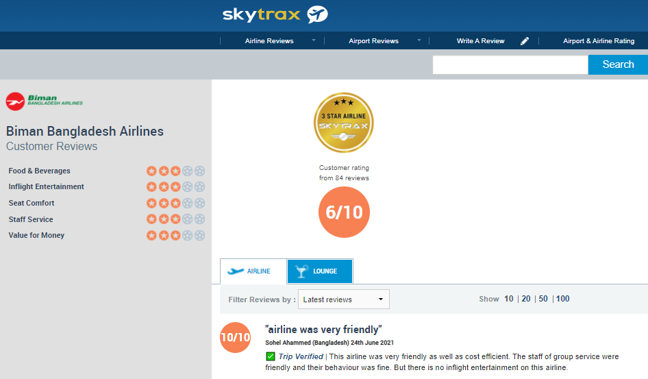
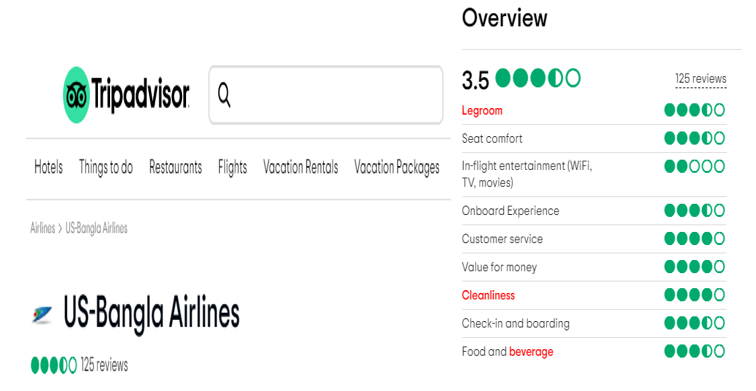

# Bangladesh-Airline-Sentiment-Dataset

Air travel is one of the most used ways of transit in our daily lives. So it's no wonder that more and more people are sharing their experience with airlines and airports using web-based online surveys. This study aims to do topic modeling and sentiment analysis on Skytrax (airlinequality.com) and Tripadvisor (tripadvisor.com) postings where there is a lot of interest and engagement from people who have used it or want to use it for airlines. The goal of individuals gathering at Skytrax and Tripadvisor is to make better decisions based on the actual experiences of other customers who have flown with airlines. We gathered online reviews submitted by consumers who have flown with Bangladesh airlines in the past.

## Datasource
The Skytrax Biman Bangladesh airline review and rating portal:

The Tripadvisor US-Bangla airline review and rating portal:



## Citation

```
@INPROCEEDINGS{9623155,
author={Hasib, Khan Md. and Towhid, Nurul Akter and Alam, Md. Golam Rabiul},
booktitle={2021 IEEE 12th Annual Information Technology, Electronics and Mobile Communication Conference (IEMCON)},
title={Topic Modeling and Sentiment Analysis using Online Reviews for Bangladesh Airlines},
year={2021},
volume={},
number={},
pages={0428-0434},
doi={10.1109/IEMCON53756.2021.9623155}}
```


